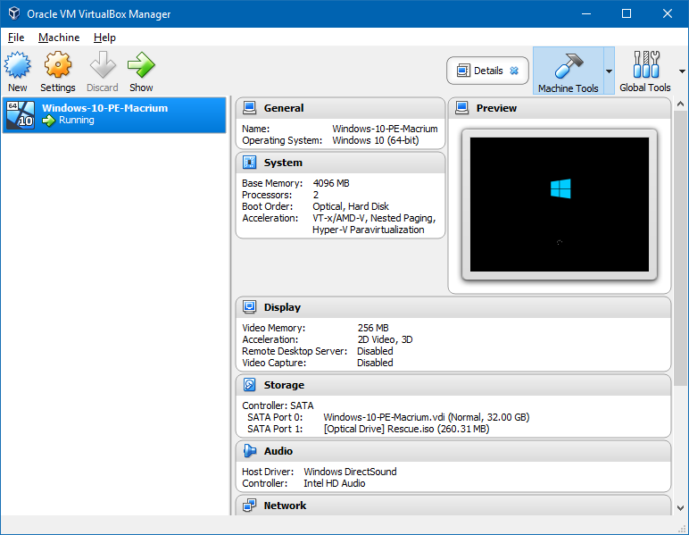
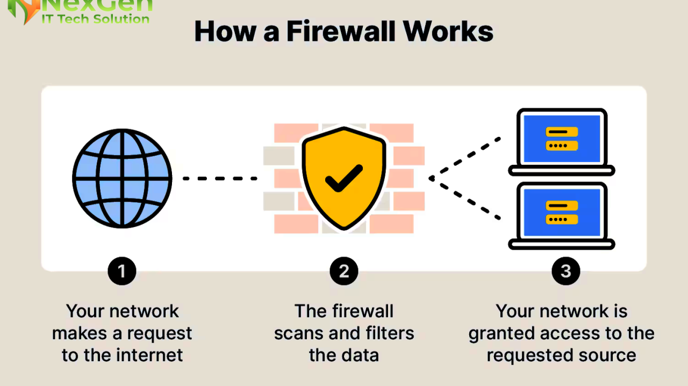
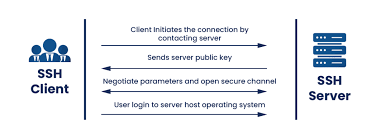

## Deliverable 1
---

## 1. What is a web server? (In the context of software Ex. Apache)
A web server is a computer program that listens for incoming HTTP or HTTPS requests from clients and delivers web content. Such as HTML  pages, images, and CSS files. Nowadays websites uses HTTPS, not HTTP.

## 2.  What are some different web server applications? Include definitions, project’s website/where to download it, which operating system is available for and its latest version.

**Examples of Web server Software they are:**
* **Apache HTTP Server:**
  * Definition: 
    * A modular, open source webserver used to host websites, providing stability and extensive community support
  * Site:
    * https://httpd.apache.org/download.cgi
  * Latest Version:
    * 2.4.67 (released 2026-05-04)
  *  OS:
    * Linux, Unix, Windows, MacOS

* **NGINX:**
  * Definition:
    * A high performance, open source web server, load balancer, and reverse proxy known for efficient event driven architecture that handles high concurrency. 
  * Site:
    * https://ngnix.org/en/download.html
  * Latest Version:
    * .29.8
  * OS:
    * Linux, Unix, BSD, MacOS, Windows

* **LiteSpeed Web Server:**
  * Definition:
    * A high speed proprietary web server that is fully compatible with Apache configurations. It is used for speed and efficiency with WordPress and dynamic content. 
  * Site:
    * https://litespeedtech.com
  * OS: 
    * It is only designed for Linux Distributions. 

## 3. What is virtualization?
Virtualization is the software-based creation of virtual versions of computers, servers, storage, or networks. 

## 4. What is virtualbox?
Virtualbox is a powerful x86 and AMD64/Intel64 virtualization product for enterprise as well as home use. It is an open source, virtualbox allows you to run multiple operating system. 

## 5. What is a virtual machine?
A virtual machine is a software based, emulated computer that runs its own operating system and applications on a physical host machine. 

## 6. In the context of virtualization, what does host machine and guest machine mean?
* **In the context of virtualization:***
  *  Host machine is the physical computer that acts as the foundation. It runs its own operating system and provides the underlying hardware resources. 
  *  Guest machine is a virtualized instance that runs within a "partition" of the host's resources. 

## 7. What is Debian?
Debian is a free open source operating system. It uses the Linux kernel, is widely used for servers and workstations, and serves as the foundation for many popular distributions. 

## 8. What is a firewall?
A firewall is a network security system that acts as a barrier between a trusted netowrk and untrusted network. 

* **They are different type of firewalls:**
  * Packet filtering firewall:
    * These firewalls inspect each packet of data that passes through them, and filters them based on source and destination IP addresses. 
  * Proxy firewall:
    * Proxy servers can provide additional functionality with security by preventing direct connections from outside the network. 
  * Web application firewall:
    * Web application firewall offer a high level of security, as they can inspect the content of packets and filter out malicious or unauthorized data. 

## 9. What is SSH?
A secure shell is a network protocol that provides an encrypted connection to access and manage a computer or server remotely in a secured way. 

To securely move files between machines using tools like SSH File Transfer Protocol. 

## 10. What is an IP Address?
IP stands for internet protocol. An IP address is a numerical label assigned to every internet of things connected to a network. 

* **They are different types of IP addresses:**
  * IPv4:
    * 32 bit numerical address
  * IPv6:
    * 128 bit alpanumeric address designed to provide a vast number of new addresses.

## 11.  What is a network mask?
A network mask is a 32 bit number that masks an IP address to divide it into a network address and a host address, determining which devices reside on the same local network. 

* **An example of network mask:**
  * 255.255.255.0
    * where consecutive 1s define the network portion and 0s define the host portion.
  * Networking rules:
    * It defines how many devices are allowed in the network
      * /24 allows 254 usable hosts

## 12.  What is a port? (in the context of networking/computers)
A port is a virtual managed by an operating system to direct network traffic. 

* **Different type of ports:**
  * Port 80 HTTP
  * Port 443 HTTPS
  * Port 21 FTP
  * Port 22 SSH
  * Port 53 Domain Name System (DNS)
  * Port 3389 RDP - Remote Desktop Protocol

## 13.  What is port forwarding?
Port forwarding is a networking strategy to give devices access to local area network (LAN), or devices. It works by directing incoming traffic from a specific public port on a router to a designated IP and port for remote access. 

* **Common useage of port forwarding:**
  * Security: 
    * Viewing IP security cameras or monitors remotely. 
  * VoIP:
    * Ensuring voice communication. 
  * Remote Access: 
    * To access a computer at home from work by using RDP protocol (Remote Desktop Protocol).
  * Servers:
    * Hosting web servers, or FTP servers.  

## 14.  What is localhost? (in the context of networking/computers)

A localhost is a hostname that refers to the current computer or device being used to access it. Acting as a virtual server for testing applications or services without a physical network connection. 

* **What localhost does:**
  * Web development:
    * Running a local server to test website changes
  * Database access:
    * Connecting to a locally hosted databases like MySQL
  * Network Security/Testing:
    * Using `ping` + `local host` to verify that the TCP/IP stack is wroking correctly on your machine.  

## 15.  What does this ip address represent 127.0.0.1?
This ip address 127.0.0.1 represent your own computer as a localhost. It allows the computer to communicate itself. 

* **Examples of this ip address:**
  * Local development:
    * Developers use it to run web servers to test applications before using them to live servers.
  * Testing services:
    * Administrators use it to check database connections without opening them up to the public network.
  * Blocking content:
    * By pointing malicious or unwanted domains to 127.0.0.1 in the system.  

## 16.  What is Git?
Git is a distributed version control system that tracks changes to files over time. Created by Linus Torvalds in 2005, the creator of Linux. 

* **Usage of Git:**
  * Snapshots:
    * Takes a snapshot of your entire project every time you save your work. 
  * Distributed:
    * Every developer has a full copy of the project history on their own computer. This allows for offline work and ensures there is no single point of failure.
  * Branching & Merging:
    * Git allows you to create separate "branches" to work on different features or fixes without affecting the main project. 

## 17.  What is GitHub?
GitHub is a cloud based platform used by developers to store, manage, and collaborate on code projects, acting as the industry standard for version control. It uses Git, allowing multiple people to work on the same project simultaneously, track changes, and merge code safely. 

* **The crucial of using GitHub:**
  * Version control:
    * Operates on top of Git, a system that tracks changes to code over time, allowing developers to revert to previous states if mistakes occur. 
  * Collaboration:
    * It allows people to work together in parallel on different branches of code, which can then be merged, reviewed, and tested, often using features like pull requests.
  * Open Source & Social Coding:
    * It serves as the largest host for open source software, where developers can contribute to public projects, follow users, and showcase their work.

