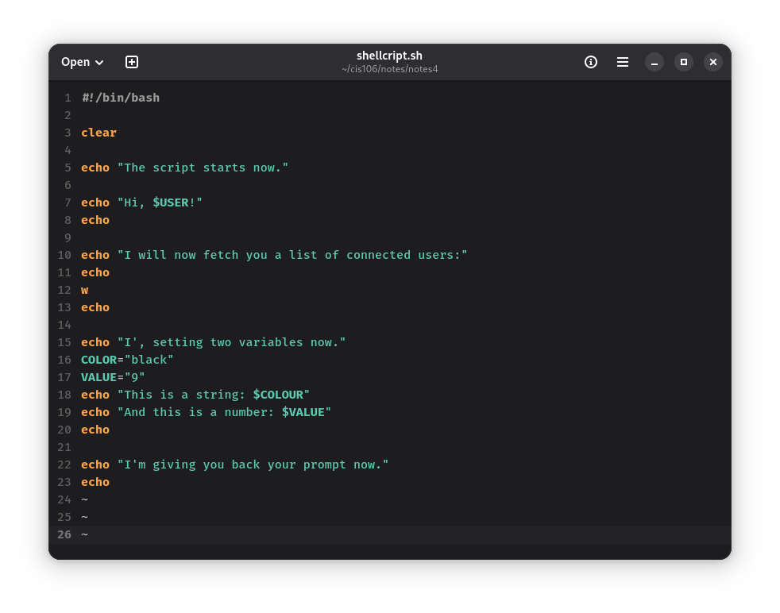
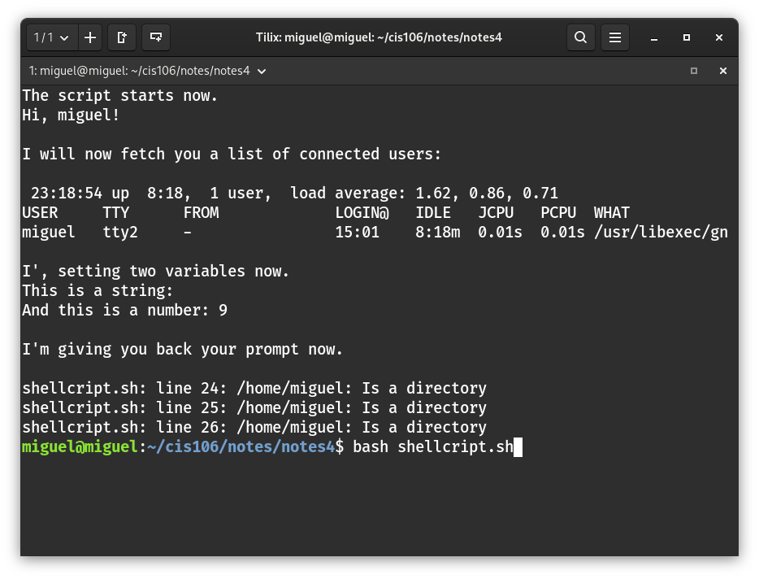

# Notes 4

## How to install and remove software using the APT command

`sudo` + `apt` + `remove text editor`
`sudo` + `apt-get` + `install mplayer`
`sudo` + `apt` + `purge` + `firefox`

## How to create a shell script step by step including screenshots and how to run it. Try to be as detailed as possible.

### Step 1 Create the file
* Open a text editor 
* Save the file as:
  * file_name.sh
* Or you could use *touch* command to 
* First, use `cd` to go directly to the folder to create the file:
  * `cd` + `/home/user/cis106/notes/notes4`
  * Use `touch` command:
    * `touch` + `shellscript.sh`

### Step 2 Add shell declaration

### Step 3 Add your code 

## Step 4 Run the script

