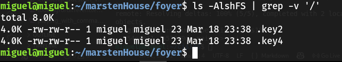

## Notes 5

# LS 
* is used for listing content or file/directory itself
* You can see what is inside the file/directory

## This is how it is used
* `ls` + `option` + `directory to list`

## Examples 
* See all options of ls command:
  * `ls` + `--help`
* Lists all png files
  * `ls` + `*.png`
* Sort by file size:
  * `ls` + `-S`
* List all hidden files in the directory
  * `ls` + `-A`
* List all files except a particular type:
  * `ls` + `--hide+*.png`
* List hidden files sorted by file size and ignoring directories
  *  `ls` + `-AlshFS` + `| grep -v '/'`

# PWD 
* Used for displaying the current working directory

## The command to display current directory
* `pwd`

# Examples for pwd
* Contains symlinks:
  * `pwd` + `-L`
* Resolve all symlinks
  * `pwd` + `-P`
* Displays all options
  * `pwd` + `--help`

# cd command 
* Changes the current directory
* Destination can be an absolute path or a relative path.
* You can go reverse by using two dots `(..)`
* A single dot `(.)` represents the current working directory.

# Examples for cd 
* Command to go home:
  * `cd`
  * `cd` + `~`
  * `cd` + `$HOME`
* Command to go previous working directory:
  * `cd` + `-`
* From current directory to a different directory:
  * `cd` + `Downloads`
  * `cd` + `~/Downloads`
  * `cd` + `/home/$USER/Documents`
* Going backwards:
  * `cd` + `../`

# What is a variable?
* Variables allow you to temporarily store information within the shell script for use with other commands in the script.
* A variable is a container or place holder for data
# How to use a variable?
* **For example: USER="Bob" is read as:**
  * USER contains the value "Bob"
  * USER has the value "Bob"
  * USER stores the value "Bob"
  * USER has assigned the value "Bob"
# What is an environment variable?
* An evironment variables  are used by the shell to**track specific system information and user information.**
* Some environment variable's value do not change from user to user, while user specific environment variable will change depending on the user logged in. 
* List of environemnt variables: 
  * `env`
  * `set`
  * `printenv`
